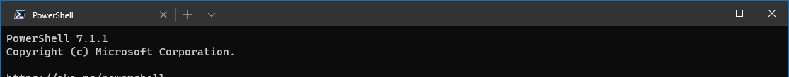
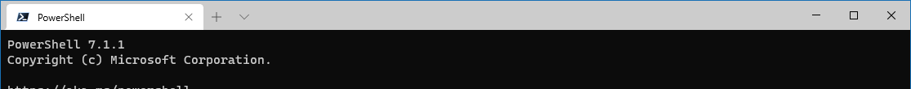
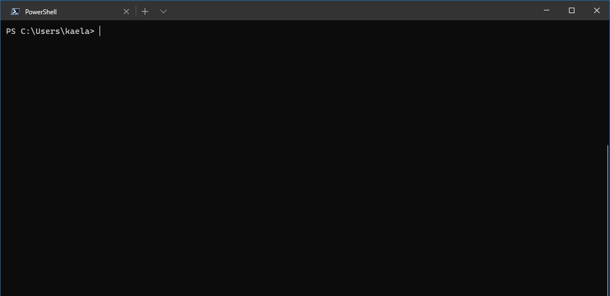
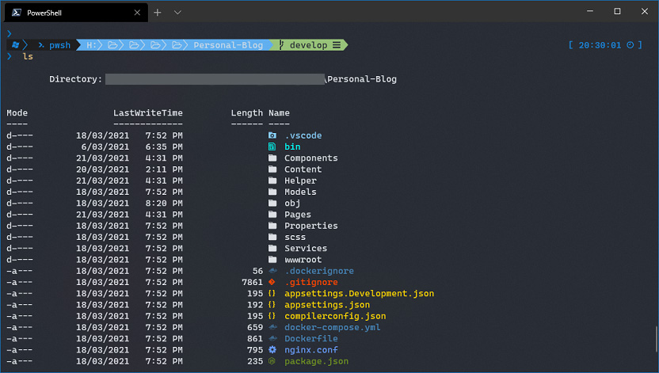
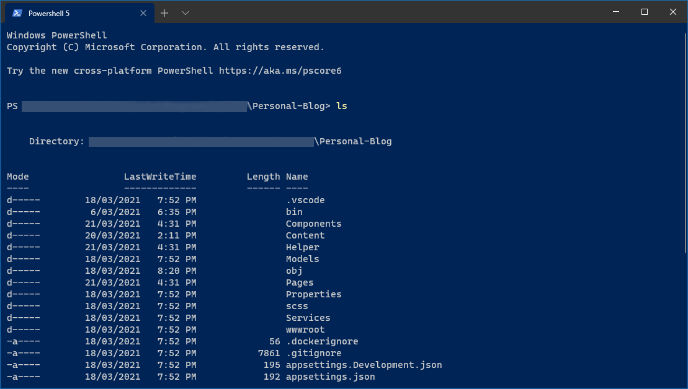
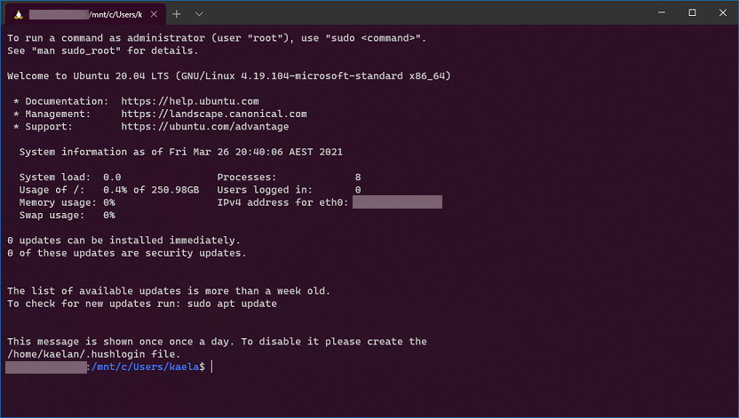
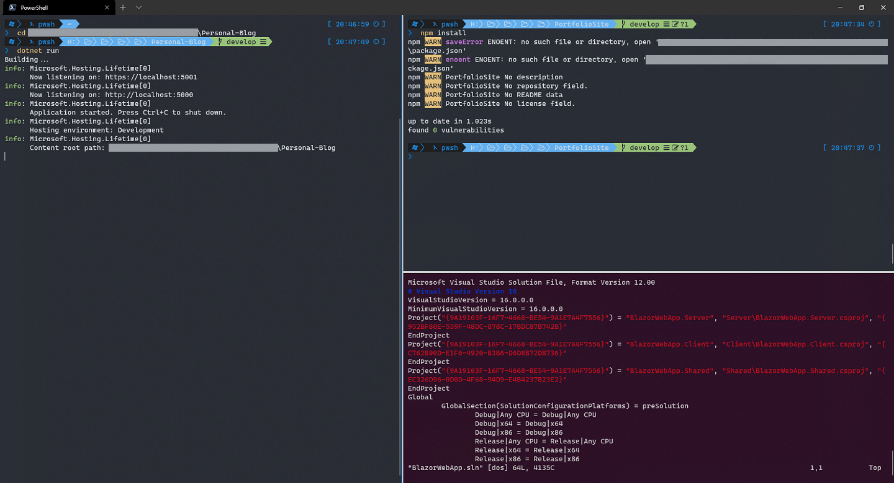
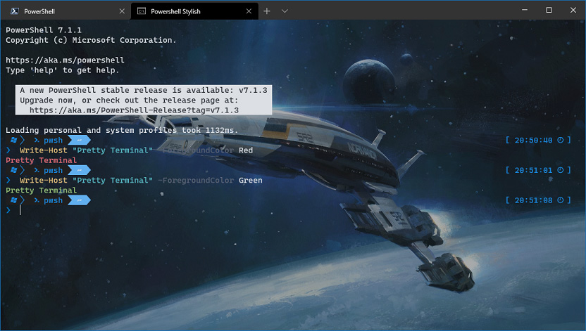
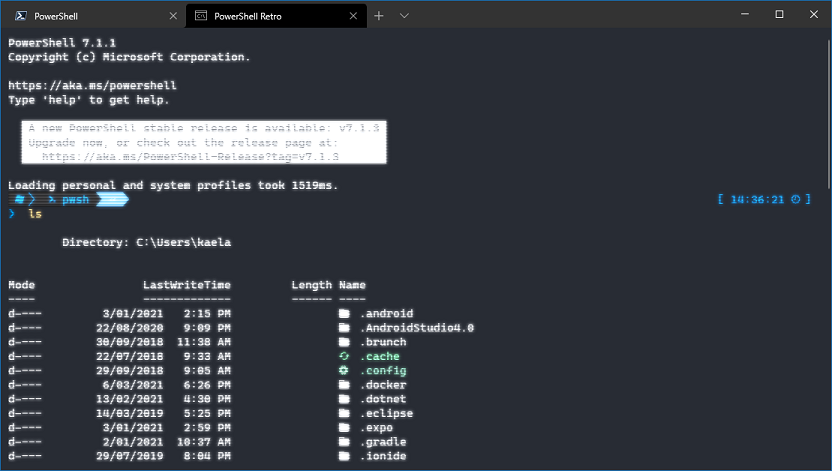

The terminal is the most functional tool a developer has at their disposal.  In general, it is not regarded as something particularly pleasant to look at, but with Windows Terminal we can make it so, with a few nice settings. Minor tweaks to layout, fonts and colours can turn a drab, colourless terminal which is tiring to look at into a vibrant display which is an absolute pleasure to work with.

While you can use the Settings UI to perform this configuration, I have provided the code snippets for convenience. Which you can copy into your `settings.json` file.

## Global

You do not need to worry about the global defaults, but the terminal looks better with the dark theme.

```json
"theme": "dark"
```

My personal preference is to 'use system theme' across devices to change between light/dark theme depending on the time of day and natural light coming into the screen. However, In this case, I would always recommend the dark theme for Windows terminal because it looks nice and sleek. Initially, I thought the light theme does not look any good, but it does look pleasant in the settings UI, however considering how much time you spend in here, probably not worth it.

**Dark Theme:**

{loading="lazy"}

**Light Theme:**

{loading="lazy"}

## Profiles

### Defaults

These are the global defaults shared across all profiles. We only really need to turn off the annoying bell sound and add some padding so text is not glued to the side of the screen.

```json
"defaults":
{
    "bellStyle": "none",
    "padding": "10, 10, 0, 10"
},
```

{loading="lazy"}

### PowerShell 7

This is the terminal I spend the most time in so I start by setting it to my favourite theme `One Half Dark` and complement it with the `Cascaydia Cove Nerd Font`  from [Nerd Fonts](https://www.nerdfonts.com/font-downloads) to get some lovely colours and symbols. I can cover the PowerShell Modules I use to enable this in a separate post. You will need both `useAcrylic` and `acrylicOpacity` set, I find the following settings provide a pleasant look.

```json
{
    "acrylicOpacity": 0.85,
    "colorScheme": "One Half Dark",
    "fontFace": "CaskaydiaCove Nerd Font",
    "guid": "{85c6abfb-cb35-404f-8394-bd296c80053c}",
    "hidden": false,
    "name": "PowerShell",
    "source": "Windows.Terminal.PowershellCore",
    "useAcrylic": true,
    "startingDirectory": "G:\\Repos"
},
```

It can be useful to set the `startingDirectory`

{loading="lazy"}

### PowerShell 5

To distinguish PowerShell 5, I give it the classic blue colour theme to the background and `tabColor`. The reason I distinguish between PowerShell 5 and 7 here is to remember about compatibility and the system my scripts will be running on.

```json
{
    "colorScheme": "Campbell Powershell",
    "commandline": "powershell.exe",
    "guid": "{785fbdfc-0109-4736-99af-e2ff17573606}",
    "hidden": false,
    "name": "Windows PowerShell",
    "tabColor": "#012456"
},
```

{loading="lazy"}

### WSL

Like the previous profile, we can set the `background` and `tabColor` to reflect the system, in this case the classic and iconic Ubuntu purple.

```json
{
    "acrylicOpacity": 0.85,
    "background": "#300924",
    "fontFace": "Cascadia Code PL",
    "guid": "{bef01612-cd36-4c8d-8c13-9d58f23aa0ca}",
    "hidden": false,
    "name": "Ubuntu",
    "source": "Windows.Terminal.Wsl",
    "tabColor": "#300924",
    "useAcrylic": false
},
```

{loading="lazy"}

I do not find myself spending a great deal of time in the WSL terminal, otherwise I would have prettied it up a bit with ZSH and its many lovely modules.

I usually use SSH in my WSL as opposed to the OpenSSH in PowerShell because it just seems to be more reliable. You can duplicate the WSL config and replace `"source": "Windows.Terminal.Wsl",` with this: `"commandline": "wsl ssh <server_alias>"` to have a profile which immediately opens an SSH connection to your server, extremely useful.

## Using Multiple Profiles

The benefit of styling your profiles uniquely comes when you are using multiple profiles at the same time. A typical scenario I will use is to have a server-side process running in one panel, client-side in the other and possibly a remote system in the third. I can tell instantly which ones are running PowerShell on my own machine and which ones are Linux based shells on another. No confusion, no random windows all over the place, similar to the example below, you can lay it out exactly how you want.

{loading="lazy"}

## Aesthetic Profiles

The last couple are purely for Aesthetics, just to spice things up you can also use your desktop wallpaper as the `backgroundImage` or use an experimental `retroTerminalEffect`.

```json
{
    "acrylicOpacity": 0.85,
    "backgroundImage": "desktopWallpaper",
    "backgroundImageOpacity": 0.6,
    "colorScheme": "One Half Dark",
    "commandline": "C:\\Program Files\\PowerShell\\7\\pwsh.exe -WorkingDirectory %UserProfile%",
    "fontFace": "CaskaydiaCove Nerd Font",
    "name": "Powershell Stylish",
    "useAcrylic": true
},
{
    "acrylicOpacity": 0.85,
    "backgroundImage": null,
    "backgroundImageOpacity": 0.63,
    "colorScheme": "One Half Dark",
    "commandline": "C:\\Program Files\\PowerShell\\7\\pwsh.exe -WorkingDirectory %UserProfile%",
    "experimental.retroTerminalEffect": true,
    "fontFace": "CaskaydiaCove Nerd Font",
    "name": "Powershell Retro",
    "useAcrylic": true
}
```

{loading="lazy"}

{loading="lazy"}

The customisation here is extensive, you could for example add your corporate logo to the theming of the terminal, which is a nice touch. You will notice I specified the `commandline` path to the executables, not sure why but If I just used `windows PowerShell core`, the profile was not being detected.

As I was writing this, a former colleague linked me to some [Windows Terminal Shaders](https://github.com/Hammster/windows-terminal-shaders){target="__blank"} if you want even more theming.

You can view my profile on [Github](https://github.com/kaelanhr/UserProfiles/blob/master/WindowsTerminal/settings.json){target="__blank"}.

So there you have it. I hoped you enjoyed this article and are inspired to make your Windows Terminal beautiful.
