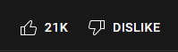
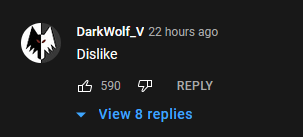

Recently YouTube conducted an experiment where they removed the dislike count on videos to test the effectiveness of combating dislike bombing and overall reducing negativity on videos. The dislike button is still there, however only the content creator is allowed to see the number of dislikes. They have since [updated YouTube](https://blog.youtube/news-and-events/update-to-youtube/){target=__blank} and decided to make this change permanent.

The change currently affects chromium based browsers and mobile apps, Firefox is not affected. It looks like the following:

There are a number of unfortunate downsides I can see this causing which reduces the value generated from this platform.

## Reduced Engagement

Social media has commonly been about marketing and engaging with your audience by talking with them  and finding out what they like and dislike. But it does not stop there, your audience communicates with each other and establishes a community. Independent content creators do this quite well, however big businesses appear to be pushing tighter control over social media content and often turn comments off completely. When I see hidden comments (and now no dislike count) it makes me wonder whether there is something they are hiding, or perhaps it is not worth discussing. This is a shame because the comments can actually be a highlight of a video, without them, content is becoming increasingly bland. Positive or negative, your post being shared and discussed is the entire point of social media. Limiting the ability for your viewers to engage and failing to foster these relationships ultimately reduces brand interest.

## Practical Application

The most  practical downside of the dislike count is as an indicator of whether a video is worth watching. A high dislike count could mean the content is not up to standards, controversial, boring or be disliked for numerous other reasons. If I navigate to a video and see a high dislike count, it is probably a good sign I should not be wasting my time and should move onto a different video. On the other hand, you may in fact choose to watch the video to see what all the commotion is about, then you can decide for yourself. This is particularly the case for videos which are 'dislike bombed'. I would therefore argue the dislike count is of greater utility to viewers than content creators.

## Algorithms Mistrust

YouTube is home to a virtually endless amount of content, most of which is delivered to us through the use of user preference algorithms. These algorithms are proprietary and mysterious but we do have some insight into these recommendations. Video likes/dislikes, type of subscribed content, similar viewers interests, recently watched videos, advertisements and a host of other variables. Sometimes these algorithms work for us and we find great content, other times the recommendations work against us and direct us towards irrelevant content. For example accidentally clicking onto a music video can doom you to endless suggestions in a genre you do not even like.  Often if we come across something we have not encountered before we can determine whether it is positive or negative based on the views of our  peers. Whilst before we would be highly suspicious if a heavily disliked video was recommended to us, now more than ever we need to ask whether it is just advertising or whether a political/social agenda is at play. It is therefore difficult to determine whether a recommendation is genuine or forced. It is also important to consider what they are not showing you.

## Anti-Negativity Campaign

This  new policy stems from a campaign across social media to remove all real (and imagined) negativity. While seemingly good intentioned this results in arbitrary  censoring, removing, cancelling which debatably causes more negativity  than responsible content moderation. Feedback from anonymous users can be full of trolls or it can be honest and critical. While it is not always easy to distinguish between the two, having the option to peruse critical content from our peers is often what drives us forward and pushes us to work harder, it is not something we want to lose.

## Building Distrust

The strongest message YouTube sends is the deep distrust it has for users and a breakdown of the relationship it has with them. This decision to remove dislike count is not addressed at bots or 'fake' accounts, but primary impacts real users . The users cannot be trusted any more to rate their own content, this method of communication but therefore be restricted. It is the equivalent of only deleting negative product reviews and significantly devalues the perceived authenticity of positive reviews. This seems to follow another trend of insulting the customer when they do not get their own way and is not an effective marketing strategy.

## Pushback

The pushback on this has been amusing, if comments are enabled people will use upvote dislike comments to gauge the like/dislike ratio.

However, this is not possible for videos which disable comments altogether. The API is apparently still open, the change is only on the frontend (for now) and a browser [plugin](https://chrome.google.com/webstore/detail/return-youtube-dislike/gebbhagfogifgggkldgodflihgfeippi){target=__blank} to restore the count. Impressively this plugin has 800,000+ users at the time of writing this, further illustrating the importance of this feature. However, I expect they will patch this work around and remove the count from Firefox.

## Closing Thoughts

Once upon a time you would post content which promotes your brand and try to engage with your audience, but the culture appears to be moving in the opposite direction. The decision to remove dislike count does not just impact trolls but is damaging to both viewers and content creators. However, I do not believe it is completely negative, if YouTube is becoming too rigid and pushing for tighter control, this may create a market opportunity for an innovative platform to deliver valuable, trustworthy content.
