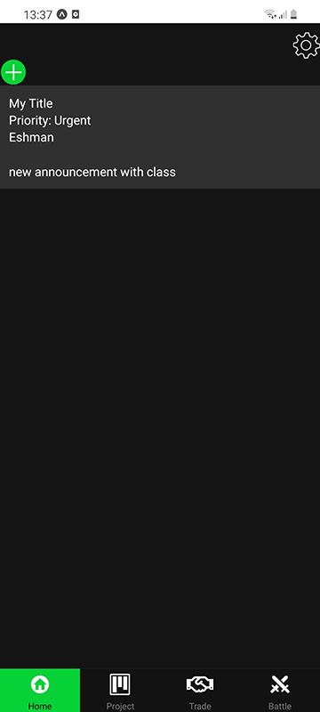
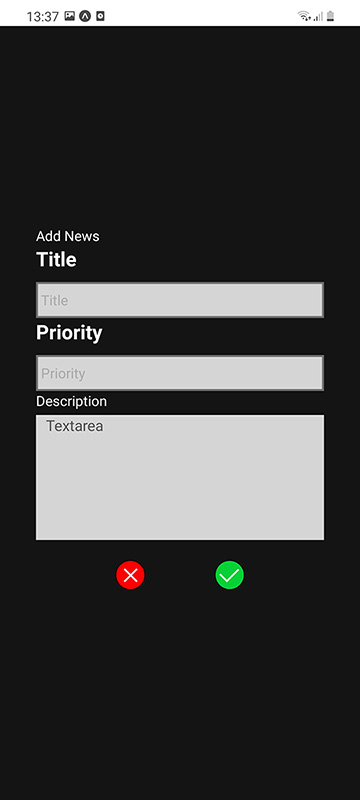
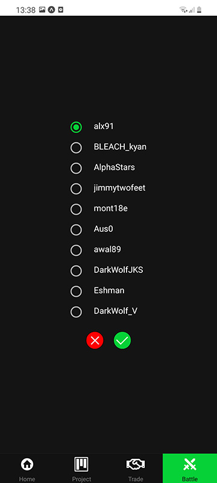
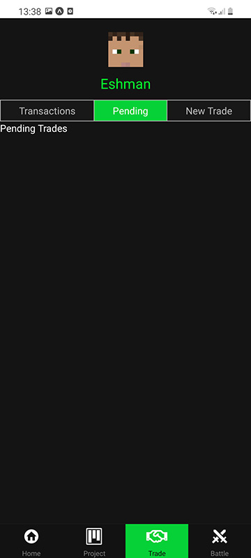
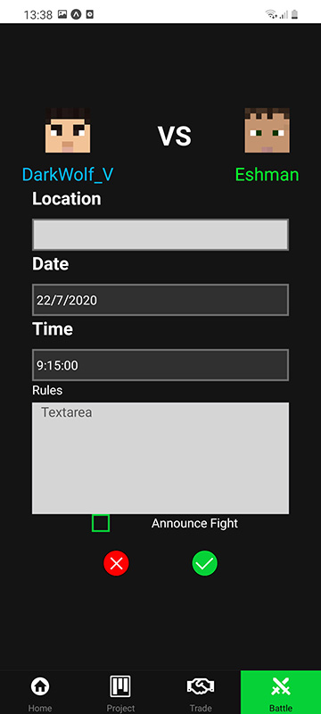

Part of my professional work involved mobile application development using Cordova. In my view this is an absolutely awful framework which I would not recommend to anyone. The proposed advantage is you can create mobile applications using html, JavaScript and CSS. It is therefore cross platform and allows shared code with the website. However, performance, development and builds are painfully slow. It is often flaky and unstable, I have literally spent days trying to get a single build working. It also another example of 'everyone has an app'. I would argue; if you are not using any mobile functionality (i.e. calls, wireless, gyroscope, camera, location, push notification), you usually just want a mobile responsive website. So what is the alternative to this? We want a reliable cross platform application with native speed and functionality. There have been brilliant advancements in software which allows you to wrap components in native functionality such that a 'button' is an 'android' button in android and an 'IOS' button in IOS. You get cross platform functionality and performance comparable to native application. This area seems like it is still maturing and has several different frameworks. I eventually narrowed my choices to React Native and Flutter. Given there was no clear advantage between either option I opted for the React option which I was more familiar with.

## Scope

I intentionally avoided guided tutorials of React Native and aimless experimentation. Instead I chose a practical learning pathway, a simple project. I decided upon a Minecraft mobile application, which would not interface with the game or server in any way, but would be used to support interaction between players of a particular server.

The primary problem I was trying to solve was organised and tracking of in game trades and the organisation of tournament style fights with other players. While this was limited in scope it did give me a great foundation for development and experimentation.

I decided on the screens and descriptions I would make for the application. Completing these to a reasonably useful state was all I wanted to achieve.

- **Home:** The initial load screen and where any player announcements are listed.
  - **Add Announcement:** Create a new announcement which appears on the home screen.
  - **Profile:** Update user settings.
- **Versus:** Radio button list of players you would select to fight against.
  - **Battle:** A form which displays who you are fighting against so you can set the time and lay down ground rules for the battle.
- **Trading:** A tabbed menu which lists *historical transactions*, *pending trades* and *proposed trades* to other players.
- **Login:** A basic login form, just for aesthetic purposes.

The back end would be non-existent because it is outside the scope of our React Native experimentation. The front script was written React Native and for the sake of my own sanity I used TypeScript.

The goal I was most interested in was learning React Native development and contrast this  with my prior experience.

## Installation

Setup is easy through expo, I just needed to run the [Quick Start Guide](https://docs.expo.dev/){target="__blank"} which was two lines from the terminal. To start my development environment I just need to call `expo start` and use the QR code on the expo mobile application to obtain a debug build  on  my phone.

{loading="lazy"}

With this running, development is extremely fast and has hot reload out of the box. It is also quick to restart in case your app  state ever gets mixed up.

## Design

The designers will not like me for saying this, but I did not care about the overall design workflow and kept it rather loose. There would be a bottom menu which is common in mobile apps. Colour palette would primarily be greyscale with a Minecraft green to highlight particular items. Player names when present would use a set of predefined primary colours.

The home screen below displays hardcoded announcements

{loading="lazy"}

### Styling

Styling is very similar to CSS and can be applied to components using the following format.

```tsx
import { StyleSheet } from "react-native";

const styles = StyleSheet.create({
 announcement: {
 backgroundColor: "#303030",
 width: "100%",
 borderColor: "#707070",
 padding: 10,
 color: Colors.White,
 },
 header: {
 marginBottom: 20,
 },
});

<View styles={styles.announcement}>
 ...
</View>
```

This enabled me to quickly style and produce fairly decent looking forms and menus which were loyal to my initial design ideas.

{loading="lazy"}

### Icons

I decided to use SVG icons which would scale to different screen sizes, however, usage was more complicated than I was expecting and required the [react-native-svg-transformer](https://github.com/kristerkari/react-native-svg-transformer){target="__blank"} library to function. It took me a little while to figure out, but once setup correctly, all I needed to do was import the SVG as a react component. Most of my icons were buttons so I just wrapped them in a `pressable` component for convenience.

```tsx
import CogIcon from "assets/images/COG.svg";

/**
 * Wrapper component to create pressable cog button.
 * @param props pressable props for cog button.
 */
export function Cog(props: PressableProps) {
 return (
 <Pressable {...props}>
  <CogIcon height={ButtonSize} width={ButtonSize} />
 </Pressable>
 );
}
```

### Development

React worked intuitively, exactly as I expected it would. VS Code auto complete works great for both components and stylesheets, dramatically increasing productivity. There were too many components to talk about individually so I will shout out the key take aways. I created a wrapper for most of the components to enable reuse of styling and features. There were a few missing out-of-the-box features from the `react-native` toolkit such as checkboxes. [react-native-base](https://nativebase.io/){target="__blank"} was an awesome library which gave me everything else I needed. One interesting note about this library was you just gave you the raw components.  For example, the 'radio button' was literally just a circle which is either selected or not. I needed to build the radio button list and selection functionality myself which was quite fun.

{loading="lazy"}

```tsx
interface IRadioButtonGroupProps {
 list: IRadioButton[];
}

/**
 * Component to display a collection of radio items.
 * @param props collection of radio buttons.
 */
export default function RadioItemGroup(props: IRadioButtonGroupProps) {
 const [selectedItem, setSelected] = useState<number>(0);

 const updateList = (value: number) => {
 props.list.forEach((element, index) => {
  if (index == value) {
  element.isSelected = true;
  } else {
  element.isSelected = false;
  }
 });

 setSelected(value);
 };

 return (
 <>
  {props.list.map((x, key) => (
  <RadioItem
   displayValue={x.displayValue}
   isSelected={selectedItem == key}
   onSelected={() => updateList(key)}
   key={x.id}
   id={x.id}
  />
  ))}
 </>
 );
}
```

Along with the bottom menu, I wanted to make my own tab set within a particular screen which worked great for the trade screen.

{loading="lazy"}

While I did not have a backend, I did experiment with a simple external connection, dynamically obtaining a users Minecraft portrait with the following component.

```tsx
export default function Avatar(props: IPlayerAvatarProps) {
 return (
 <View style={{ alignItems: "center" }}>
  <Image
  source={{
   uri: `https://minotar.net/avatar/${props.username}.png`,
  }}
  style={styles.avatar}
  />
  <Text style={{ fontSize: 20, marginTop: 10, color: props.color }}>
  {props.username}
  </Text>
 </View>
 );
}
```

The results were exactly what I wanted.

{loading="lazy"}

## Closing Remarks

I barely scratched the surface for what is possible with mobile application development using React Native, but it was a  substantially more pleasant experience compared to Cordova. Performance, development, debugging and other tools available were all superior. There were a few clunky elements such as SVGs and the simulator misbehaving, but these were minor and I expect they will get ironed out over time. I hope it continues to see wider adoption.

I have often thought about creating a mobile application for basic Minecraft server administration, if this application is to evolve any further this is the direction I would like to take it.

You can find the source code of this application on [Github](https://github.com/kaelanhr/MinecraftApp){target="__blank"}.
