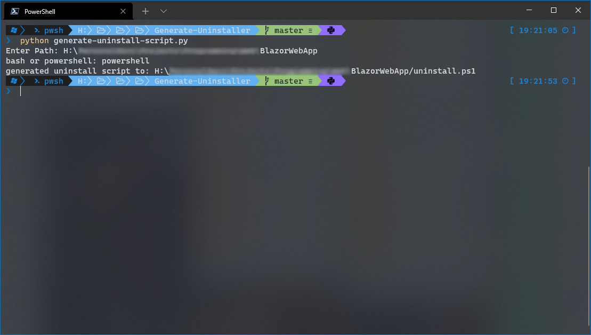

A common problem when you are creating or installing mod packs is you can have mod assets mixed in together and indistinguishable from each other, this is common in Bethesda modding community. I was not familiar with programming whilst I was originally developing my Fallout mods, therefore, I usually told them to follow two steps.

1. Untick the mod from whatever mod manager you are using.
2. Remove all the models, textures and other files which came with the mod.

However, as I alluded to earlier, this is not simple because you need to put thought into manually hunting down each of these files. To simplify this process I decided to create a program which would generate this script for me in the form of either PowerShell or bash.

## Prerequisites

- Python must be installed.
- Download the uninstaller from [GitHub](https://github.com/kaelanhr/Generate-Uninstaller){target="__blank"}

## Usage

1. Separate all the assets you will potentially be uninstalling into a unique folder. If we are talking about zip files this is the release folder for a mod author and the extracted archive for an end user.
2. Open a terminal and `cd` to the `Generate-Uninstaller` Python script location
3. Run the Python script with `python generate-uninstaller-script.py`
4. Enter the root directory of the unique folder from step 1.
5. Enter whether the uninstall script will be `bash` or `PowerShell`
6. An uninstall script will be generated in the root folder you specified.
7. Verify the uninstall scripts works as expected.

{loading="lazy"}

> Warning: Please verify the generated uninstall script was created correctly and ONLY removing what it should, it is your responsibility to ensure the uninstall script does not do undue harm.

I have added support for 'exclude paths' to ignore certain folders so feel free to open the Python script and add to this list.

There were no programming classes offered whilst I was at school, I started learning at university, but most of my knowledge was either self taught or developed through hands on experience. If I had known Software Engineering earlier, my mods would be tidier and would have been faster to develop. In any case, these are lessons I will take into the future, I hope you find this script useful.
