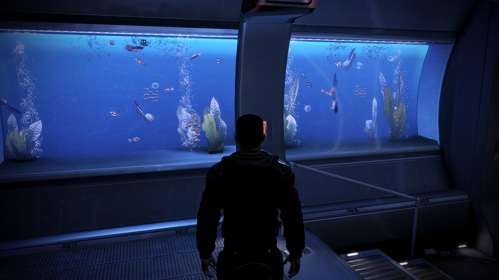
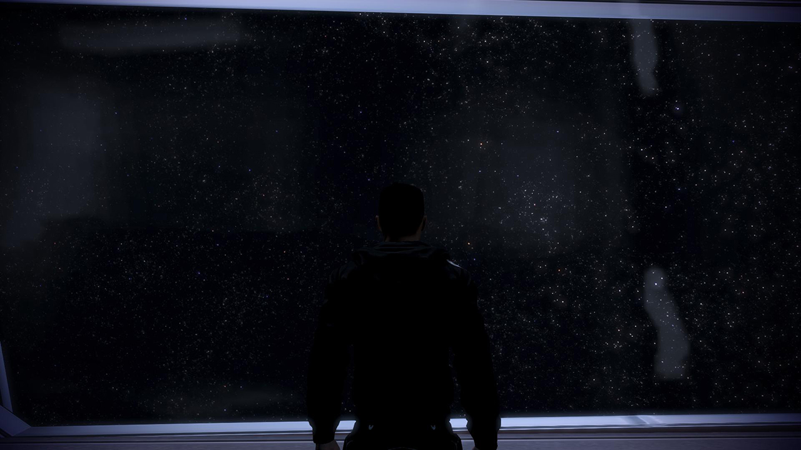

When I first heard about Mass Effect Legendary Edition, my initial reaction was excitement. They are releasing a major graphics and gameplay update bundled with all the DLC. This unifies the games into a single modern platform. However, rather than rushing to purchase this, I paused to weigh the pros/cons of this new edition.

## For

* **DLC:** - Mass Effect 1 & 2 were released before the rise of unified game platforms such as origin or Steam. The DLC's were therefore not consolidated and sometimes had exclusive requirements. With the legendary edition you can enjoy everything Mass Effect has to offer.
* **Nostalgia:** Travelling the galaxy, meeting your favourite characters again is something to look forward to.
* **Updated Gameplay:** Without going into specifics, legendary edition has modernised the UI and included numerous gameplay improvements.
* **Updated Visuals:** The graphics have also been updated, the game looks stunning.
* **First time players:** If you have not played Mass Effect before, this edition is perfect. I would highly recommend this RPG as one of the most memorable and engaging stories with an amazing cast of characters.

{loading="lazy"}

## Against

* **Price**: If you have already completed this trilogy you would have spent in excess of `$200`. This edition will cost you an additional `$89.95`. Now, I do not want to completely discount the effort developers put into this. The game looks stunning but at the end of the day these are not new games.
* **Relative Cost Effectiveness:** If I contrast Mass Effect 'Legendary edition' with the 'Master Chief' collection for Halo, I find Halo is substantially more cost effective. Halo has significantly more replayability and combat diversity at a lower pricepoint.
* **Decisions**: Mass Effect is very much about making decisions and dealing with the consequences. However from my  perspective, by the time you get to the end of the game, most of these decisions are trivial. Either there is an extra line of dialogue or character present or there is not. In any case I would likely make all the same decisions I did last time I played the game. The game is entirely linear and there are clear limits for what you can discover and what you can do.
* **Time**: With limited time available to play games, this is not one I wish to spend my time replaying
* **Multiplayer**: Despite the fact EA servers were unreliable and you would frequently lose progression, Mass Effect 3 had a great 4 player cooperative game mode.There were a tonne of different weapons and classes to unlock. Unfortunately Multiplayer was cut from the Legendary Edition. Comparing this to Halo again, you receive dramatically reduced mileage from the game.

{loading="lazy"}

Overall I understand why BioWare released the Legendary edition and why people are keen to play it again. They were each amazing games and this release has generated renewed admiration for the series. However, this is not enough for me to jump onboard. A limited time constraint and the fact I have exhausted all of the games decisions results in limited value for veterans of the series. On the other hand, if you have never played the series before this will generate substantial value and I would highly recommend it to you.
