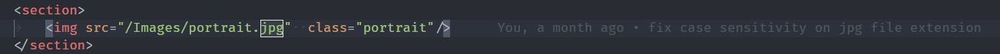
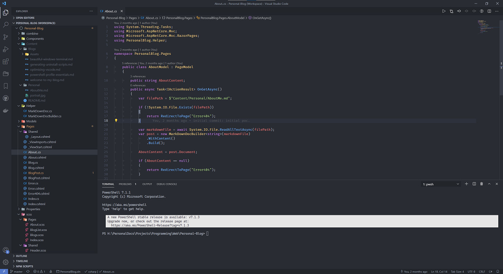

VS Code works extraordinarily well out of the box, the settings are intuitive and reasonable, they must have really done their homework. There are only a handful of tweaks which need to be made.

## General Settings

We can boost productivity by improving the aesthetic and practical utility of using the editor. A minimalist approach which focuses on reducing complexity, clutter and distractions enables you to  focus on your more intensely and for longer time periods. The following settings use font ligatures, font family and other tweaks to increase readability and perform simple clean up steps.

```json
// Insert a space character when commenting.
"editor.comments.insertSpace": true,

// Cursor animation style.
"editor.cursorBlinking": "phase",

// Cursor style.
"editor.cursorStyle": "line-thin",

// Controls whether `editor.tabSize#` and `#editor.insertSpaces` will be automatically detected when a file is opened based on the file contents.
"editor.detectIndentation": false,

// Font family
"editor.fontFamily": "Fira Code Retina",

// Configures font ligatures or font features.
"editor.fontLigatures": true,

// Automatically format the pasted content. A formatter must be available and the formatter should be able to format a range in a document.
"editor.formatOnPaste": true,

// Insert spaces when pressing `Tab`. This setting is overridden based on the file contents when `editor.detectIndentation` is on.
"editor.insertSpaces": false,

//  - boundary: Render whitespace characters except for single spaces between words.
"editor.renderWhitespace": "boundary",

// The editor will scroll using an animation.
"editor.smoothScrolling": true,

//  - inline: Show snippets suggestions with other suggestions.
"editor.snippetSuggestions": "inline",

// How suggestions are pre-selected when showing the suggest list.
//  - first: Always select the first suggestion.
"editor.suggestSelection": "first",

// Enables tab completions.
//  - on: Tab complete will insert the best matching suggestion when pressing tab.
"editor.tabCompletion": "on",

//  - on: Lines will wrap at the viewport width.
"editor.wordWrap": "on",

// Trim trailing whitespace when saving a file.
"files.trimTrailingWhitespace": true,

// Terminal font family of the terminal, only supports mono fonts.
"terminal.integrated.fontFamily": "Cascadia Mono",
```

## Git Settings

I will always recommend beginners learn git command line to learn how everything works under the hood. However, VS code simplifies operations and minimizes mistakes with inline git diff and a variety of other integrated tools. I recommend the following settings:

```json
// Commits will automatically be fetched from the default remote of the current Git repository. Setting to `all` will fetch from all remotes.
"git.autofetch": true,
// Confirm before synchronizing git repositories.
"git.confirmSync": false,
// Commit all changes when there are no staged changes.
"git.enableSmartCommit": true,
```

## Extensions

There are an incredible number of high quality extensions (you can also make your own). Their default settings also work very well out of the box.

### Management

* [Bookmarks](https://marketplace.visualstudio.com/items?itemName=alefragnani.Bookmarks){target="__blank"} - Little needs to be said, bookmark lines of code you keep coming back to.
* [Project Manager](https://marketplace.visualstudio.com/items?itemName=alefragnani.project-manager){target="__blank"}  -  Organise and switch between workspaces with ease.

### Utility

* [GitLens](https://marketplace.visualstudio.com/items?itemName=eamodio.gitlens){target="__blank"} - This builds enormously on the build in git functionality, I should probably explore this more, but like most people I primarily use it for inline git blame.



* [Path Intellisense](https://marketplace.visualstudio.com/items?itemName=christian-kohler.path-intellisense){target="__blank"} - Inline completion when specifying paths.
* [PowerShell](https://marketplace.visualstudio.com/items?itemName=ms-vscode.PowerShell){target="__blank"} - I always use PowerShell for automation, so if you are writing PowerShell, do not leave home without it.
* [Markdown all in one](https://marketplace.visualstudio.com/items?itemName=yzhang.markdown-all-in-one){target="__blank"} - an inexhaustible amount of intuitive  editor improvements for Markdown.

I wont bother to list out many language specific extensions because there is one for virtually every programming language. For the most part language extensions work quite well, but if you are expecting them to be as good as JetBrains you are going to be disappointed.

### Themes

I cannot recommend enough the Iconic Atom [One Dark Pro](https://marketplace.visualstudio.com/items?itemName=zhuangtongfa.Material-theme){target="__blank"} theme and the [Material Icon Theme](https://marketplace.visualstudio.com/items?itemName=PKief.material-icon-theme){target="__blank"}. This theming is easy on the eyes and has a beautiful colour pallette.

{loading="lazy"}

I searched extensively but could not come up with a viable alternative light theme to the default `Light (+)` VS Code theme. If anyone ends up finding (or creating one) I would be very interested.

## Code Quality

* [Code Spell Check](https://marketplace.visualstudio.com/items?itemName=streetsidesoftware.code-spell-checker){target="__blank"}: Whether you are using it to write technical documentation, comments or variable names it is incredibly useful to improve the quality of your code and even detect bugs.
* [Prettier - Code formatter](https://marketplace.visualstudio.com/items?itemName=esbenp.prettier-vscode){target="__blank"}: A language formatter for virtually every language I have encountered, Improves quality by saving time and giving consistency to your codebase.

The following settings are useful.

```json
// Enable / Disable allowing word compounds. true means 'arraylength' would be ok, false means it would not pass.
"cSpell.allowCompoundWords": false,

// Indent lines with tabs
"prettier.useTabs": true,
```

I hope you find this list of settings and extensions useful, setting up a pleasant and productive development environment and continuing to optimise it is something I am very passionate about. These settings should be a solid starting point for any type of software development, to know the ins and outs of VS Code I would highly recommend the official [Tips and Tricks](https://code.visualstudio.com/docs/getstarted/tips-and-tricks){target="__blank"} guide.
