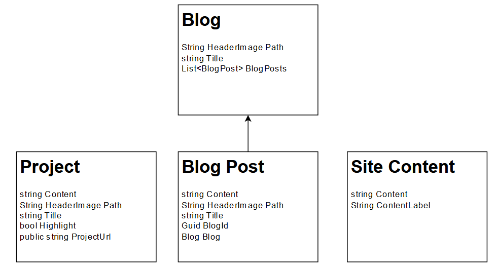
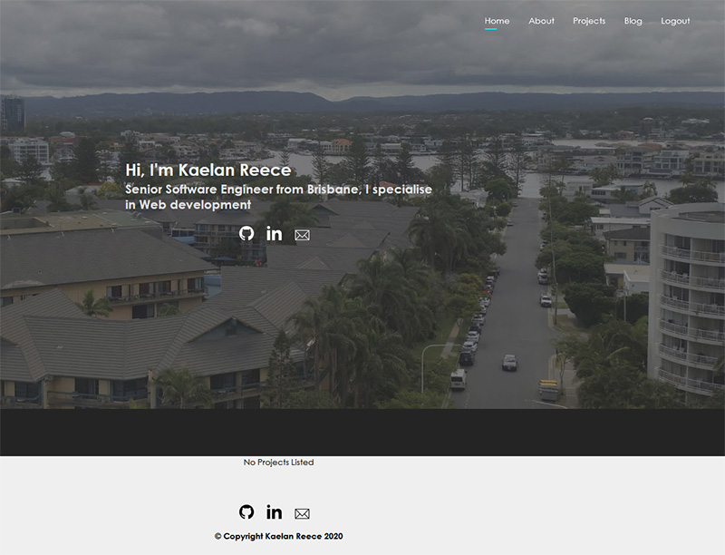
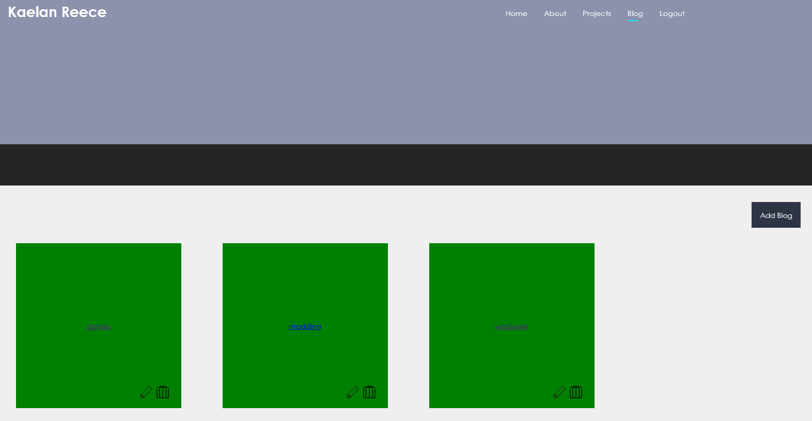

I have always believed learning involves putting skills into practice, this is particularly true in programming. Personal projects are an effective way to deviate from the academic path because this is where you learn, trying to solve problems. Every software engineer wants to break free of the chains of technical debt they often find themselves in and start up a project which consist of their favourite suite of modern tools. This is why I fell into a trap and jam packed my portfolio website project with software I did not need. From this mistake I learned a great about engineering design. It is important to pick the right tool(s) for the job and avoid using the same approach for everything. In this case, I picked my favourite front-end, back-end and database. If I had taken a step back I might have realised you need very little to create a mostly static blog website. Whilst I had pre-selected a great web stack and was generally happy with the code, It was more complicated and less performant than I wanted. The solution was overkill and not optimal for what I was trying to achieve. It is dangerously easy to get wrapped up in coding and miss the bigger picture, but if you put on your creative hat, simpler is better. Here is how I overengineered my portfolio website.

## Requirements

I started by defining my requirements, trying to keep them practical and simple.

* **Markdown Content:** I enjoy using Markdown as documentation and have worked with Markdown content libraries in the past There is great support for turning Markdown into html.
* **Search**: Search Blogs or Projects by 'Title' or 'Content'
* **Admin Account**: One admin user which can perform create, edit or delete operations on projects, blogs and site content.
* **Mobile Responsiveness**: I expect a large portion of readers to use mobile devices.
* **Pagination**: Pagination on blogs/projects to allow scalability as content grows.

In my estimation these requirements are quite reasonable as an MVP for a blog website. However, there are already flaws here: searching all articles by their entire content is not optimal or scalable and there are methods to avoid user management (authorisation,authentication, etc.) altogether. I resolve each of these problems in the successor project, which I will explore more later.

## Tech Stack

As far as I am concerned the following are the strongest tools on the market for building a modern web application because they are mature, easy to work with and perhaps most importantly fun to use.

* **Front End:** TypeScript React & SCSS
* **Back End:** ASP.Net core
* **Database:** PostgreSQL

At this point in my career I was actively developing with these tools, as part of a modernisation phase of the business. However, there was much I did not understand because the boilerplate for the framework was already setup. This project gave me the opportunity to experiment and appreciate how enjoyable developing software can be in my spare time.

Production would be deployed with `docker`, behind an `Nginx` reverse proxy to create a portable, scalable and secure web application. The database and backend are joined together with `Entity Framework Core` and the creation of markdown can be facilitated on the front end with [react-markdown-editor-lite](https://www.npmjs.com/package/react-markdown-editor-lite){target="__blank"}.

{loading="lazy"}

## Model

Ignoring user accounts which are primarily an extension of Asp.Net Core users, the model is outlined below.

{loading="lazy"}

A `Blog` would represent a category such as 'gaming', 'life' or 'software' and  each category would contain `Blog Posts`. Project would functionally be another type of blog post, but I could 'highlight' particular posts to appear on the main page. `Site Content` would be used to capture arbitrary customisable site information.

This model was already flawed, I did not need the extra layer of complexity of `Blog` and `Project`, all I really need is `Blog Posts`, there are other methods I can use distinguish them. I have used WYSIWYG to store html in the database before, but it just feels strange these days, somehow doing the same with markdown feels better. With this model I also have a versioning problem, storing content in the database would require an extra layer of application code and redesign to manage versions. I would also need to setup database backups.

## Design

Like most web engineers I know how to produce the required html and SCSS which is faithful towards a provided design. However, I had never put an exceptional amount of effort into design work itself. Given my background in marketing, I do recognise how important this is. A popular and most importantly free product for designing is [Adobe XD](https://www.adobe.com/au/products/xd.html){target="__blank"}. I was impressed with both the onboarding and ease of use, having worked with Adobe in the past I should not have been surprised.

After the initial onboarding I was ready to start designing and began researching existing blogs and picking out elements which I liked. I have seen many cases of 'over-designing' applications and wanted to avoid this, therefore my design was kept simple, at least from a users perspective. For this project there would only be two user types, `Visitors` and `Admin` (Me)

{loading="lazy"}

Admin functionality of updating and deleting would appear on the front end when you were logged in.

> Note: The green is not faithful to the design, it is incomplete styling.

{loading="lazy"}

## Software Architecture

I started with a standardised dotnet architecture and had some nice, generic services to call. However partway through I was interviewing for a job which were strong advocates for the [Clean Code Architecture](https://github.com/jasontaylordev/CleanArchitecture){target="__blank"}, I therefore pivoted the project towards this architecture. I have to admit, I do like the separation of dotnet projects and I can see how it will certainly make testing easier. However, I do regret doing this on the existing project because I lost track of where everything was and given the website was relatively simple, I believe it was unnecessary and had an overall negative experience with this architecture.  I ended up turning down the job offer they gave me, but I will reserve my opinion on this architecture style given my lack of practical experience working with it. This and the other reasons identified were why I eventually abandoned this project in favour of simpler architecture.

## Lessons Learned

I started  off with good intentions and ultimately from a technical perspective I was relatively pleased with the project. It was not a waste of time because I learned an immeasurable amount of technical, design and systems engineering skills.

**Building software from scratch:** Often you work with tools and frameworks which are already developed, by building everything I could better understand what each line of code was doing. I started to have 'lightbulb' moments for how the framework functioned and I figured out the consequences for omitting what appeared to be boiler plate code. This is perhaps the most important lesson because if you do not know the purpose or function of your code, you are essentially being held hostage to it and need to work around it, rather than working with it.

**Design:** The design itself was fine and I did reuse much of this in the successor project. It was interesting to learn how much I despised neglecting myself as the admin user in favour of the front end user.

**Model:** As always, simpler is better. The model had one layer of complexity too deep and I could potentially drop the need for authenticated users altogether.

**Tech Stack:**  If I had the choice again of building a web application, I would pick the same tech stack because I think they are great and would like to continue to use them, however they were too much for the problem I was trying to solve. Given the simplicity of what I was trying to accomplish, I did overengineer it, my beliefs have evolved. I believe a marketing/blog website should be all about maximising performance and SEO, these are disadvantages of an SPA.

**Deployment:** I learned how to setup and build the website completely through docker, including certificate configuration. The relationship between docker and firewall rules was not what I expected, because of this I had to move the Nginx server from the target machine into a docker container and only expose the ports I needed.

**API:** I spent substantial effort creating API end points for CRUD operations, much of which was duplicated between server and client. The fact is I would never use them again outside the front-end interface, if I am not integrating with any apps then there is no point in creating these APIs.

**Software Architecture:** Never change code architecture part way through, you are better off starting from scratch and porting over logic, this was something I greatly regretted.

Overall, It was a great experience and I took many of the lessons learned into the successor project which this blog is deployed on, I will cover this in greater detail in a future post. You can find the source code for the portfolio website on [Github](https://github.com/kaelanhr/PortfolioSite){target="__blank"}.
