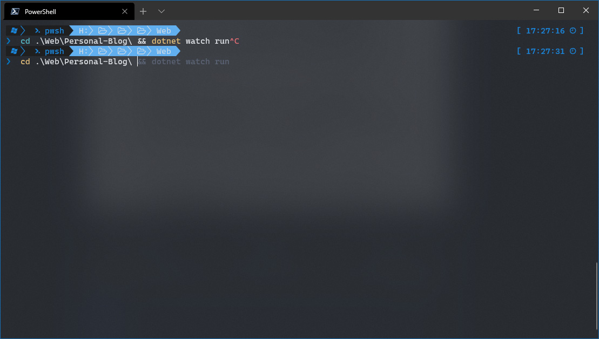
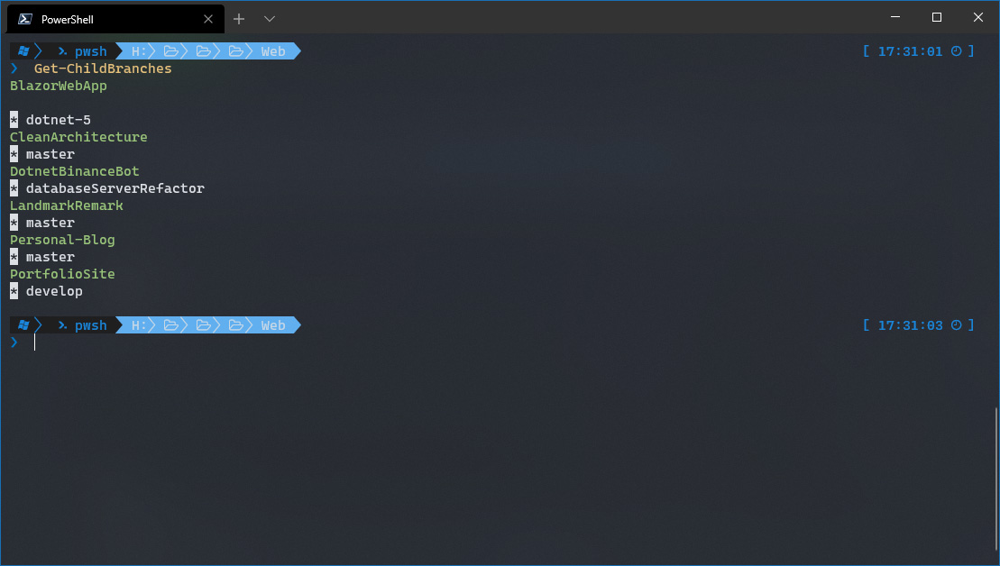

The PowerShell profile is the code executed while the session is starting up and is equivalent to the bashrc. This is therefore where you want to import any modules or declare any common functions. There are a number of modules and functions which I can recommend to optimize your PowerShell experience, improving both productivity and quality of life. To find your profile, type `$PROFILE` into PowerShell, if the file is not in the location specified, then create it.

## Modules

**[Terminal-Icons](https://github.com/devblackops/Terminal-Icons){target="__blank"}** is a PowerShell module which shows file and folder icons in the terminal colour codes them. This module requires [Nerd Fonts](https://www.nerdfonts.com/font-downloads){target="__blank"}, but I would specifically recommend my personal favourite terminal font, `Caskaydia Cove Nerd Fonts` which was designed with Windows terminal and supports font ligatures.

{loading="lazy"}

> Note: You will need a terminal which supports these characters, I would recommend Windows Terminal.

**[oh my posh 3](https://github.com/JanDeDobbeleer/oh-my-posh3){target="__blank"}** is a highly customisable prompt theming engine. It is not only cross platform but cross shell, you therefore get a consistent setup regardless of whether you are running Powershell or ZSH. This is why I like it to specify the current OS in the prompt.

Install the modules:

```powershell
Install-Module -Name Terminal-Icons
Install-Module oh-my-posh
```

Add the following to your `$PROFILE`:

```powershell
Import-Module oh-my-posh
Import-Module -Name Terminal-Icons
```

You can pick from an existing theme by running `Get-PoshThemes` and `Set-PoshPrompt` to select the theme or take my [profile](https://github.com/kaelanhr/UserProfiles/blob/master/OhMyPosh/poshConfig.json){target="__blank"} and start tweaking it.

```powershell
Set-PoshPrompt -Theme "<path to config file>"
```

For more information on customisation and theming you can visit the [official documentation](https://ohmyposh.dev/docs/){target="__blank"} which are quite comprehensive.

{loading="lazy"}

[**PSReadline**](https://github.com/PowerShell/PSReadLine){target="__blank"} actually comes pre-installed in PowerShell, but I would recommend upgrading to a newer version. This module updates the commandline editing experience of PowerShell with improved autocompletion, key bindings, interactive history search and a host of other features.

Install the latest version with:

```powershell
Install-Module PSReadline -AllowPrerelease -Force
```

 This will enable the inline prediction history which is incredible and provides a similar experience to ZSH modules and fish. The following are my recommended settings.

```powershell
Remove-PSReadlineKeyHandler -Key Tab

# bash style tab completion
Set-PSReadlineKeyHandler -Chord Tab -Function Complete

Set-PSReadlineKeyHandler -Chord shift+tab -Function MenuComplete
Set-PSReadlineKeyHandler -Function DeleteCharOrExit -Chord Ctrl+D

# remove this annoying bell
Set-PSReadlineOption -BellStyle None

# configure up and down search hstory
Set-PSReadlineKeyHandler -Key UpArrow -Function HistorySearchBackward
Set-PSReadlineKeyHandler -Key DownArrow -Function HistorySearchForward

# command history location
Set-PSReadlineOption -HistorySavePath C:\temp\history.txt

# use inline prediction
Set-PSReadLineOption -PredictionSource History

# a more distinguishable colour
Set-PSReadLineOption -Colors @{InlinePrediction = "`e[90m" }
```

{loading="lazy"}

This is a neat one my friend sent me, simply bind the creation of a GUID to a shortcut, beats going to a random website to grab a GUID.

```powershell
Set-PSReadLineKeyHandler -Key Ctrl+g -ScriptBlock {[System.Guid]::NewGuid() | Set-Clipboard}
```

## Functions

One of my favourite functions, is one i created soon after starting professional software engineering. I often use it in combination with other functions.

```powershell
# navigate to a location, execute a command and navigate back.
function cdc {
    Param(
        [string]$path,
        [scriptblock]$command
    )
    $here = Get-Location;
    Set-Location $path;
    try {
        & $command;
    }
    finally {
        Set-Location $here;
    }
}
```

As an example, the following functions build on `cdc` and are adaptable to perform arbitrary command on all child git directories. The only limit here is your imagination.

```powershell
function Invoke-SubProjectsCommand() {
    Param(
        [scriptblock]$command
    )
    Get-ChildItem -Directory | ForEach-Object {
        if (Test-Path $_/.git -PathType Container) {
            Write-Host $_.Name -ForegroundColor Green
            cdc $_ $command
        }
    }
}

function Get-ChildBranches() {
    Invoke-SubProjectsCommand {
        git branch | Select-String "\*"
    }
}
```

`Get-ChildBranches` will return the following output.

{loading="lazy"}

This one also speeds up my workflow.

```powershell
# used to alias explorer opening in the current directory.
function Open-Explorer() {
    explorer .
}

Set-Alias ex Open-Explorer
```

I hope to build on this as I find more amazing PowerShell modules and other useful settings. If you would like to grab my full PowerShell profile, you can find it on [GitHub](https://github.com/kaelanhr/UserProfiles/blob/master/PowershellCore/Microsoft.Powershell_profile.ps1){target="__blank"}. If you were curious how I got my Windows terminal to look so snazzy, check out my [Beautiful Windows Terminal](./beautiful-windows-terminal){target="__blank"} blog post.
