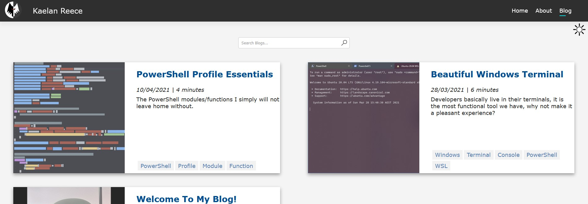
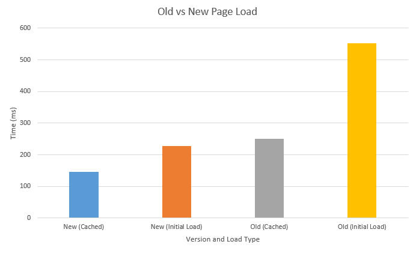
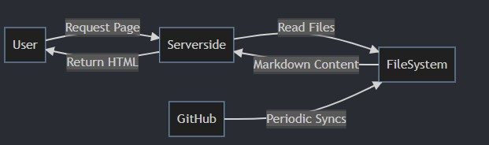
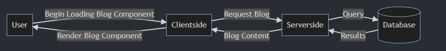

In the modern world it is becoming increasingly important to market yourself and establish a distinct online presence, to achieve this I decided a blog would be an appropriate format. This challenge represented an opportunity to develop my writing/communication skills, document my learnings, side projects and anything else I found interesting. I previously attempted this last year and documented the process of [overengineering the portfolio site](./portfolio-site){target="__blank"}. This article describes how I took those learnings to develop Version 2.0.

## Key Improvements

I identified the following improvements for the new version:

* Simplified Model
* Simplified Tech stack
* Simplified API's
* Consistent architecture

## Requirements

The next step was to re-define my requirements focusing on consistency and simplification.

* Markdown rendered as HTML
* UI Pages
  * Home
  * About
  * Blog List
  * Blog Post
* Search Blog Posts
* Fast Load times (new)
* Light weight (new)
* SEO Optimisation
* Mobile Responsive

Compared to the previous version, there are only new 2 new requirements, but what is important here is what is missing, what I need to cut to generate the desired improvements.

* User Authentication
* Admin UI
* CRUD API's
* Database

This removes many of the features of a full web application, because I actually do not need them, I have an alternative method. Rather than creating content through the UI as an admin and storing it in a relational database, I was inspired by Microsoft docs to store markdown content in a git repo. This enables a simpler model and architecture and I get versioning as a free feature.

## Design

Despite the fact I just made a critical technical decision, I was not ready to settle on a tech stack, I wanted to make sure I considered the user experience first. Thankfully I could re-use the research and designs from the previous version with minor modifications. I designed web first and then considered how the mobile view would look. I found this relatively straightforward. I do not mean to say this is easy, designers do great work, I just had the advantage of a simple design and project scope.

{loading="lazy"}

### Audience

With my requirements redefined, I know the application would be read-only for my users:

* Software Engineers (junior or senior)
* Myself - as a source of documentation
* People interested in my mods

## Architecture

The most important part of implementing the key improvements is the architecture. Single Page Applications (SPA's) are known for creating fast and powerful UI's. However, they have longer page load times and are less optimised for SEO because they need to execute JavaScript for the client side to appear. I have the most experience using React front end and ASP.Net core back end. However, state updates, building a library of re-usable UI components were not features I actually needed. With the decision to simplify the tech stack I decided to use server side rendered razor pages with ASP.Net Core. Whilst I had never used razor pages, I have used blazor which is easy to learn. The result was better than expected, with extremely fast load times, better SEO and cutting out the client meant I did not need to spend time stitching the  front and back end together.

The following chart compares the average dom load time between the versions. The old blog site had no data, despite this, the middleware is more complex, it needs authorisation as well as JavaScript  execution for page rendering. The new blog site does not need to do either of these things and just sends the html straight to the end user. If the old version did have data I would expect these numbers to explode up as you add on the time for retrieving and processing endpoints (including database) and the growing side of the client side codebase to download. Essentially what I am  comparing here is a client vs server side rendered application,  which of course the server side rendered is faster. My point here is pick the best one for the right job, not just the tool you are  most  comfortable  with. If you are building an interactive web application, server side rendered might not be for you.

{loading="lazy"}

The minimum and  maximum  load time are found to be more than 50% faster.

|     | New (Cached) | New (Initial Load) | Old (Cached) | Old (Initial Load) |
| --- | ----------------- | ----------------------- | ----------------- | ----------------------- |
| Avg | 145.64ms            | 226.64ms                  | 249.73ms            | 552.82ms                  |
| Min | 94ms                | 138ms                     | 186ms               | 351ms                     |
| Max | 401ms               | 339ms                     | 337ms               | 830ms                     |

## Implementation

I decided to store markdown content in a git repository and convert those files into html. I found [markdig](https://github.com/xoofx/markdig){target="__blank"} to be an exceptionally fast and feature rich markdown converter.

There were a few options on implementing the converter:

1. Read files on disk and put the html into the requested blog page, custom sync method with repo.
2. At startup or file update, generate a static html version of the blog, custom sync method with repo.
3. Send a 'get' request to github to get the latest version of a blog post.

Option 3 meant the blog would always be up to date, but I would be dependent on another service and I was not confident about the speed and reliability of this method. Option 2 would no doubt be the fastest, but I believe the static html generation and syncing process would just be weird. I decided option 1 would provide a balance of speed and ease of use. A cron job is used to sync the repository daily.

The new process is demonstrated below:

{loading="lazy"}

This compares to the process in my old SPA application. Client goes to server, which goes to database which materialises a server side model which is then put into a client  side model. As seen below.

{loading="lazy"}

There is absolutely  nothing wrong with this, in  fact it is standard middleware, but it is slower and requires more processing.

I used 'yaml front  matter' of Markdown files to create objects for searching and filtering.

```yaml
blurb: How I reengineered my blog to be lightning fast, light weight, SEO optimised and responsive.
title: Reengineering my Blog
path: reengineering-my-blog
tags:
    - Blog
    - Web Development
    - Razor
    - Markdown
published: 2021-09-01
length: 8
```

A noteworthy feature I found was the ability to use blazor components in razor pages to share code between home and blog list pages.

```html
@using PersonalBlog.Models;
@using System.Web;

<section id="blog-list-wrapper">
    <section class="blog-list">
        @foreach (var blog in Blogs)
        {
            <section class="blog-list-item">
                <a class="nav-link text-dark blog-list-thumbnail" href="/blog/@blog.Path">
                    <div>
                        
                    </div>
                </a>
                <section class="blog-description">
                    <section>
                        <h2><a class="nav-link text-dark" href="/blog/@blog.Path">@blog.Title</a></h2>
                    </section>
                    <section class="blog-metadata">
                        <span>@blog.Published.ToString("dd/MM/yyyy") | @blog.Length minutes</span>
                    </section>
                    <span class="blog-blurb">@blog.Blurb</span>

                    <section class="tags-wrapper">
                        <section class="tags">
                            @foreach (var tag in blog.Tags)
                            {
                                <a href="/blog?search=@HttpUtility.HtmlEncode(tag)" class="blog-tag">
                                    <span class="blog-tag">
                                        @tag
                                    </span>
                                </a>
                            }
                        </section>
                    </section>
                </section>
            </section>
        }
    </section>
</section>

@code {
    [Parameter]
    public IEnumerable<BlogPost> Blogs { get; set; }
}
```

I can call the component on each page with the following syntax.

```html
<component type="typeof(Components.BlogList)" render-mode="Static" param-blogs="@Model.Blogs" />
```

While it  would be trivial to implement tracking or advertisements in an attempt to generate revenue, It would result in a performance hit. I also find it unethical and it does not fit with the purpose of the application. You can view the source code on [Github](https://github.com/kaelanhr/Personal-Blog){target="__blank"}.

## Closing Remarks

I have found as you grow in knowledge, experience and skill as a Software Engineer, it can become easy to overengineer by blinidly following familiar technologies and mindsets. Reengineering this website was an effective way to increase my confidence, apply learnings from my prior mistakes and emphasised the ever necessary importance of simplifying problems. While the requirements for this project remained largely the same, I took a completely different approach which led to a greater product. I was pleased to build this website and believe the project  overall has made me a better developer.
