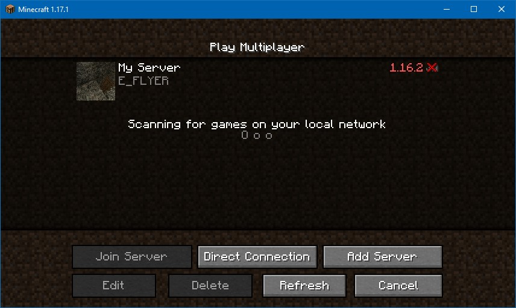
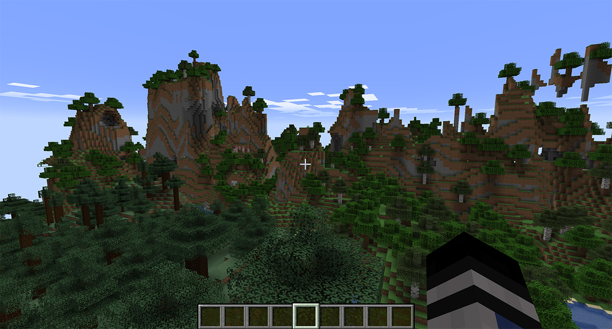

I started playing Minecraft in 2010 and would host a server on my desktop computer all through high school and university. The server installation process is relatively straightforward, download the server.jar from the official Minecraft and setup some port-forwarding. However, it is impractical and expensive to keep your server running all the time so I had both availability and static IP address problems.

After starting as a Software Engineer, a colleague advised me on the installation process for his remote Minecraft server. I could use this opportunity to upskill in Linux server administration and solve my Minecraft problem. This article will document installing and managing a Minecraft server on a remote Linux system.

This article will assume basic command line competency.

## Obtaining a remote server

> Note: If you already have a provider you can skip this step. In this case I used Vultr.

1. Create a [Vultr](https://www.vultr.com/){target="__blank"} account
2. Pick a relatively advantageous geographical server location
3. At least 2 CPU's and 4gb of ram are required.
4. Latest version of Ubuntu (18.04 in my case, 20.04 also tested)
5. Link up your payment and install the server.
6. Find your username and password in the settings.
7. SSH into the server with the credentials provided.

I chose a Ubuntu server because it is simple, I do not need to pay a Microsoft premium and it is generally widely supported. I would also recommend using enhancing security with SSH keys. This [guide](https://confluence.atlassian.com/bitbucketserver/creating-ssh-keys-776639788.html){target="__blank"} might be useful.

## Setting up Minecraft

### Install Java

Java must be installed to run the Minecraft server.

```bash
sudo apt update
sudo apt upgrade
# For Minecraft version 1.17+ open jdk 16+ is required otherwise use a different version.
sudo apt-get install openjdk-16-jdk
```

Best practice is to have a specific owner for each application, rather than running everything as root.

```bash
useradd -M mcuser
usermod -L mcuser
mkdir /home/mcuser
```

### Install Minecraft Server

The Minecraft server instance can be downloaded from [minecraft.net](https://www.minecraft.net/en-us/download/server){target="__blank"}. If you have an existing world you can zip it up and upload it to your server.

Use sftp to transfer the zip file including your `server.jar` to the server.

```bash
sftp <server_ip_address>
cd /home/mcuser
put <local_path_to_zip_file>
unzip <zip_file_name>
```

If you run `ls` you should see your files in this directory.

Update file ownership to the Minecraft user.

```bash
sudo chown -r mcuser:mcuser /home/mcuser
```

#### Configuring Minecraft Server

You need to set the `eula` to enabled. Open the text file with `nano` or `vim` and set the eula to `true`.

```bash
vim eula.txt
```

Open the `server.properties` file in a text editor and update the properties to suit your preferences.

```bash
vim server.properties
```

> Note: If you do not have either the `eula.txt` or the `server.properties`, attempting to start the server will create them.

The following command will run the server.

```bash
/usr/bin/java -Xmx2048M -Xms2048M -jar /home/mcuser/<server_jar_name>.jar nogui
```

Load up Minecraft locally and attempt to connect to the server address in multiplayer: `<ip_address>`. If you can connect, switch back to your terminal and shut down the server with `ctrl+c`, we can now setup server management.

{loading="lazy"}

### Server Management

Supervisor run the application in the background and logs standard output/errors.

#### Install Supervisor

```bash
apt-get install supervisor
service supervisor restart
```

Create a Minecraft configuration file

```bash
touch /etc/supervisor/conf.d/minecraft.conf
```

Open the config file with a text editor and use the following configuration.

```ini
[program:minecraft]
user=mcuser
directory=/home/mcuser
command=/usr/bin/java -Xmx2048M -Xms2048M -jar /home/mcuser/<server_jar_name>.jar nogui
autostart=true
autorestart=true
stderr_logfile=/var/log/minecraft/supervisor.err
stdout_logfile=/var/log/minecraft/supervisor.out
stopsignal=INT
```

Create log files.

```bash
mkdir /var/log/minecraft
touch /var/log/minecraft/supervisor.err
touch /var/log/minecraft/supervisor.out
```

Apply the configuration.

```bash
supervisorctl reread
supervisorctl update
```

Your server should now be running and you can start playing!

To check the status of the server you can use `supervisorctl status`. You can use `supervisorctl fg minecraft` to bring the server to the foreground.

You can increase the performance of your server by allocating more ram to the server. I would suggest creating a 4gb [swap file](https://linuxize.com/post/create-a-linux-swap-file/){target="__blank"} and updating server arguments in your `minecraft.conf` to use `-Xmx4096M -Xms4096M`. You will need to apply the configuration with another

```bash
supervisorctl reread
supervisorctl update
```

I have previously covered how you can use [scheduled tasks for Minecraft servers](./scheduled-tasks-minecraft-servers){target="__blank"} and would recommend you do the same. I hope you found this article useful.

{loading="lazy"}

Happy Crafting.
