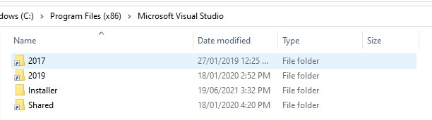
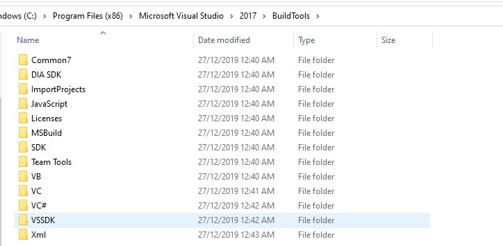

The `C` drive is the primary storage drive of Windows computers. To dramatically improve boot time and operating system performance it is preferable to use a solid state drive (SSD). Personally, I recommend installing the bare minimum on the `C` drive and just use it for downloads, temporary storage space and basic programs/documents. Long term, infrequently accessed storage (i.e. personal documents) should reside on a large secondary hard drive, whereas frequently accessed storage requiring high read/write speeds (i.e. games and other programs) should exist on a secondary SSD. However, if your `C` drive has low storage capacity you will run into issues when certain programs, caches or temporary storage begin to clog up space and are required to reside on the primary drive. An effective method to combat this issue is symbolic links. I first encountered this problem with Visual Studio which appears to have major issues when installed on a secondary drive. I can resolve this with symbolic links.

Symbolic links or Symlinks are more advanced versions of file/folder shortcuts. From the Operating System perspective symbolically linked files/folders exist in the specified location, in truth they remain elsewhere, possibly on a completely different drive.

As an example, you can run the following command to create a symbolic link for Visual Studio to another drive:

```powershell
cd "C:\Program Files (x86)\Microsoft Visual Studio"
New-Item -ItemType SymbolicLink -Path "2019" -Target "G:\Program Files (x86)\Microsoft Visual Studio\2019\"
```

{loading="lazy"}

You can now install Visual Studio to the `C` drive through this symlink. After installing, if you open to `C:\Program Files (x86)\Microsoft Visual Studio` you will notice a shortcut which appears to be on the `C` drive but is actually a symlink to the path on the `G` drive.

{loading="lazy"}

Two other use cases for me were the 'Sins of a Solar Empire' mod folder and the '.android' folder which were consuming dozens of gigabytes.

```powershell
New-Item -ItemType SymbolicLink -Path C:\Users\<username>\Documents\My Games\Ironclad Games -Value G:\Ironclad Games\
New-Item -ItemType SymbolicLink -Path C:\Users\<username>\.android -Value G:\.android\
```

I hope you found this guide useful, If you find files/folders exhausting space and wish to reclaim it, symlinks might be a cost effective solution.
