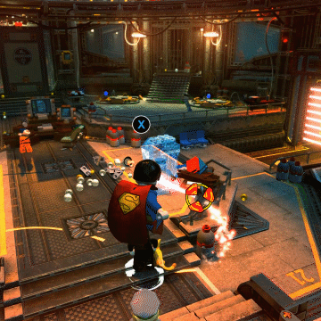
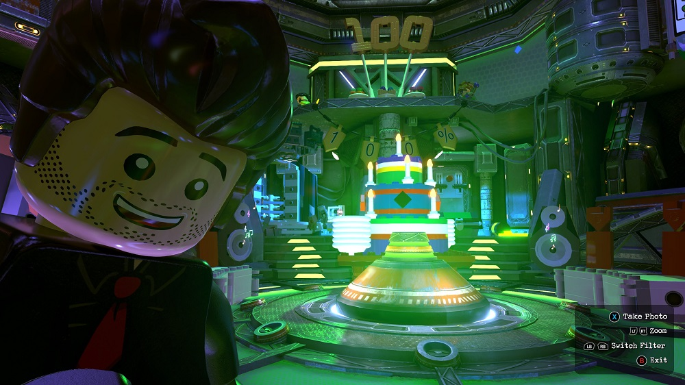

Lego games were an incredibly fun part of my childhood. I remember growing up I would check after every mission to see which character I could buy and attempt to grind out missions to purchase all of my favourite characters as soon as possible. I would also spend significant time messing around in the hub. Flash forward to modern day and my strategy for playing these games is substantially optimised. I cannot help but use a snowball strategy to complete the game as fast as I can.

The Process is something like this:

* Finish story mode
* Obtain 2x Studs Brick
* Obtain 4x Studs Brick
* Obtain 6x Studs Brick
* Obtain Minikit Detector
* Obtain Red Brick Detector
* Get Collectibles from all remaining levels
* Complete Hub missions and obtain 100% completion

{loading="lazy"}

The stud bricks multiply together resulting in a whopping 3840x bonus to stud collection, with this you can purchase everything you want in no time.

{loading="lazy"}

If you are playing a DC lego game, Superman is extremely effective with his flying abilities, laser vision and invulnerability. You can blitz through the game, going virtually anywhere on the map and destroying anyone in your way with ease. An overpowered custom character further enhances the experience.

{loading="lazy"}

As far as I can tell this is the most effective strategy and optimises the balances between extracting the most fun out of the game and grinding to completion. You can focus on enjoying the storyline initially and then obtaining all of the unlocks in the least grindy way possible.
