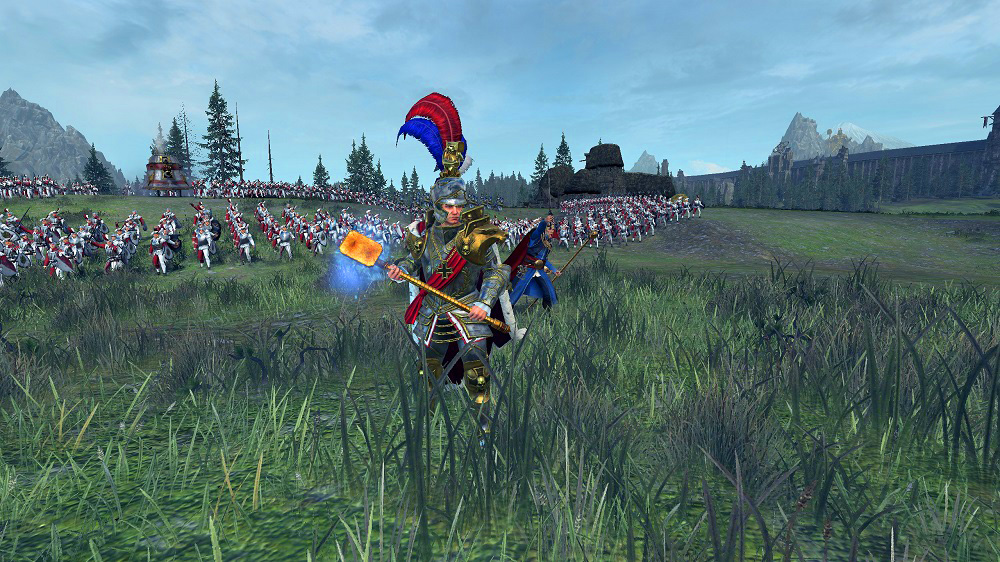

Total War Warhammer is one of the best trilogies I have  ever had the pleasure of playing. Each game functions standalone, but also builds on top of  what is already there with updated factions, mechanics and content which produces a lively and fun atmosphere. The Creative Assembly (CA) developer team always delivers, but I also need to commend their marketing team in the  way they build hype for each game and  DLC release. They seem to be very active in the community and often partner with content creators with streams, trailers and announcements which make us all feel like we are on a journey together.  For the final instalment in the series I expect them to go all out. Here is what I am excited to see in Total War: Warhammer 3.

## Warhammer World

The final game of the series will cover the entire Warhammer fantasy world. There is such a rich and diverse landscape across the entire world and I expect this game to build out the northern Chaos Wastes and the lands to the east connecting Cathay to the rest of the world. The second game introduced settlement habitability for factions, I am keen to see what else they will have in store for us.

## New Factions

The biggest addition to this game is the 6 new headlining factions and an unconfirmed bonus pre-order faction. I am only moderately excited for the new factions because personally most of the major factions and characters I like to play are already in the game. However, I am more than happy to be proven wrong in this regard, I just know less about their lore and characters.

### Kislev

{.flex}
{loading="lazy"}
{loading="lazy"}

Kislev is another human faction and feels like an interesting derivative of the Empire, they are an order faction which is on the front lines of the conflict. Apart  from their new units, characters and strategies I look forward to having the full force of Chaos brought to bear on Kislev and feeling as  though you are holding back the tide for the rest of the world. In a similar sense to Game of Thrones with the white walkers, you will attempt to stop the political squabbles in the south to rally against a greater threat. In Warhammer 2, Kislev is a generic Empire faction which gets stomped long before you are in a position to help them so it will be interesting to see how this dynamic has evolved.

### Chaos

{loading="lazy"}

The first Warhammer game  I ever played was Dawn of War and Chaos were among my favourite  enemies. Warhammer 3 adds 4 Chaos factions (one for each Chaos god), creating an interesting and diverse range of enemies to fight. This will require a  different set of strategies and builds  depending on  who you are going up against. While I primarily play order factions, I do enjoy a little Chaos  from  time to time and rolling over the Empire, High Elves and the rest of the world  or playing them against each  other. I know more about 40k Chaos than I do fantasy, but I Imagine they are comparable which is why Khorne berserkers I am particularly looking forward to using. Tzeentch or Slaanesh look  interesting , however the aesthetics of Nurgle do not appeal to me.

### Cathay

I imagine I am in the same boat as everyone else when it comes to Cathay. I know next  to nothing about their lore (and as I understand little actually does exist). In theory CA has  virtually endless freedom with them so I am curious  to see what they come up with. As I touched on before, I personally find the aesthetics of a factions leaders and unit roster to be important, I am on the  fence with these guys until  we learn more.

### Pre-Order Bonus

The pre-order bonus faction has not been revealed  yet, but I think the recent Ogre Mercenaries 'free-lc' for Warhammer 2 indicates it will be Ogre Kingdoms. Here is another faction I am not sure about, but I imagine they will increase the diversity of roaming horde factions which is  always a good thing.

{loading="lazy"}

## Expansion factions

The release of  Warhammer 3 is looking promising, but so is the future expansions or lord packs. I am hoping they use this opportunity to bring in some of the biggest names which are currently missing, in particular Nagash. There are already an enormous number of undead/Vampire factions so I am curious to see what unique mechanics he has, potentially uniting multiple undead factions, once can hope.

In terms  of new standalone factions, the main one which comes  to mind is Chaos Dwarves who I think will be a force to be reckoned with.

## Existing factions

We should not forget the factions already in the game.  I expect these to initially have minor tweaks to bring them up to par with game 3 factions and then to each have moderate overhauls throughout the lifetime of hte game. I am always ready to 'summon the Elector Counts' and start a new Empire campaign as Karl Franz to rid the world of Chaos.

{loading="lazy"}

I look forward to Total War Warhammer 3 and anticipate it to be one of the biggest and best games I will ever get to play.
