I was surprised to find few guides which actually cover Windows 10 tips and tricks. This is my power user guide to improving productivity and includes tips  ranging from keyboard shortcuts to full programs to enhance your desktop experience. In this guide I will skip over the extremely basic computer usage with the assumption they are known (copy,paste, select all, etc.).

## Keyboard Shortcuts

I use these shortcuts every day and am surprised by how few people know about them.

`ctrl+shift+n` - Create a new folder in file explorer

`F2` - Rename the selected file or folder in file explorer

`win+shift+s` - Open snipping tool selection, save from notifications or paste directly from your clipboard.

`win+v` - Open a clipboard menu at your cursor which includes snipping tool images.

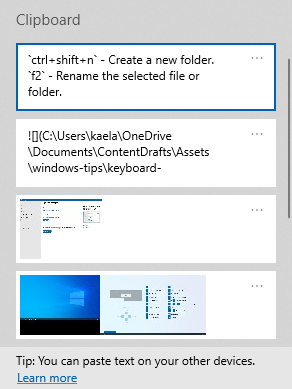{loading="lazy"}

`win+ctrl+arrow` - switches back and forward between virtual desktops

`win+tab` - opens time line and task view, manage virtual desktops

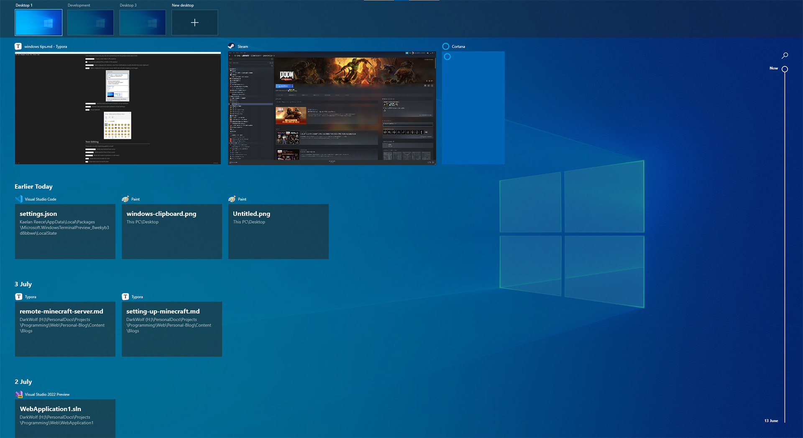{loading="lazy"}

`win+.` - opens emoji clipboard

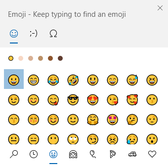{loading="lazy"}

## Text Editing

I hope everyone learns these. If you are coming from Mac, `home` and `end` keys are a godsend.

`ctrl+backspace` - Backspace entire word

`ctrl+delete` - Delete entire word in front of text cursor

`ctrl+arrow` - Move text cursor to previous or next word

`home` - move text cursor to start of a line

`end` - move text cursor to end of a line

## Volume Mixer

Right click your speakers in the bottom right and click 'Volume Mixer'. This one has been in Windows 10 forever and is useful for adjusting the volume between different specific applications or disabling the audio altogether.

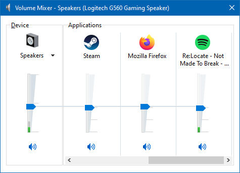{loading="lazy"}

## Windows PowerToys

[PowerToys](https://github.com/microsoft/PowerToys){target="__blank"} is a suite of free open source utilities designed by Microsoft to improve the Windows 10 experience and productivity. I will not cover all tools, just the ones I personally find useful.

### Color picker

Get the colour of anything on your screen. Particularly useful for design focussed individuals.

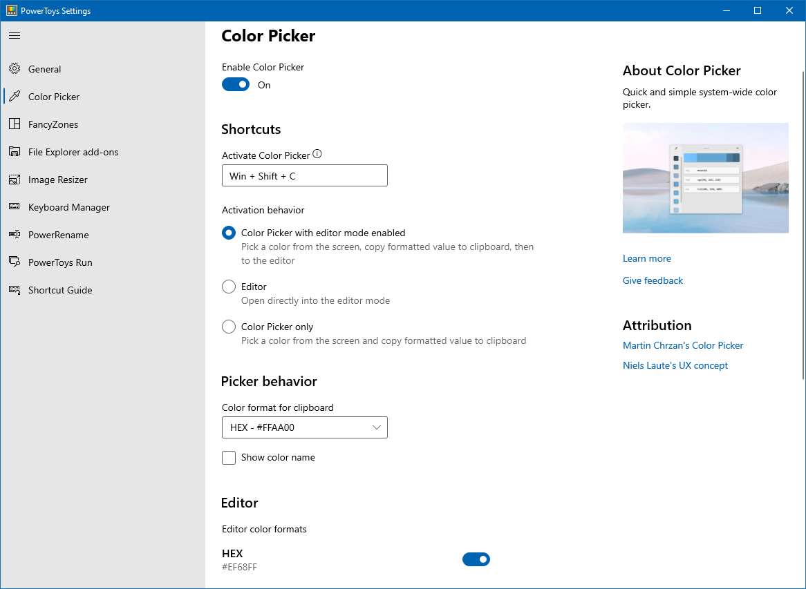{loading="lazy"}

### Image Resizer

From your right click context menu resize 1 or more images. Beats the hell out of individually editing each in paint!

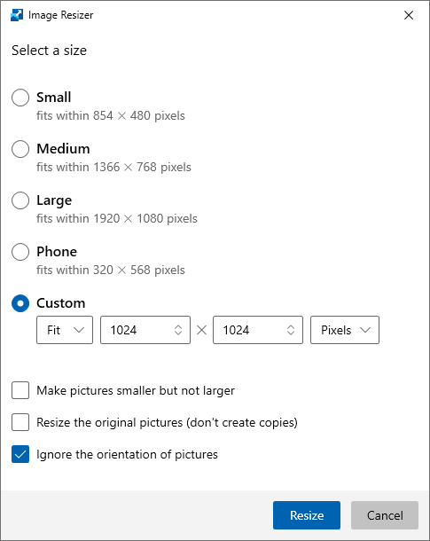{loading="lazy"}

### PowerRename

You can mass rename files using a search and replace which supports regular expressions and the options outline below. Saves time and the need for writing a custom script.

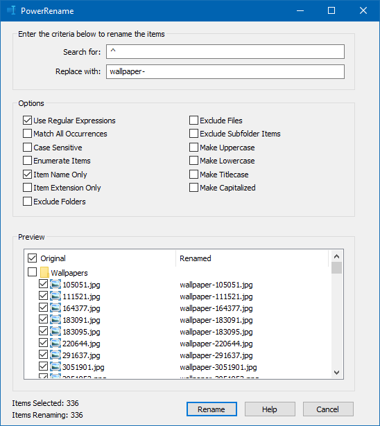{loading="lazy"}

### Fancy Zones

Windows 10 by default lets you split applications either in half  or into a grid just by dragging them. Fancy Zones takes this a step further by allowing you to custom design those particular zones to suite your workflow. This is excellent if you need to directly access several programs at the same time and is particularly useful if you have an Ultrawide monitor.

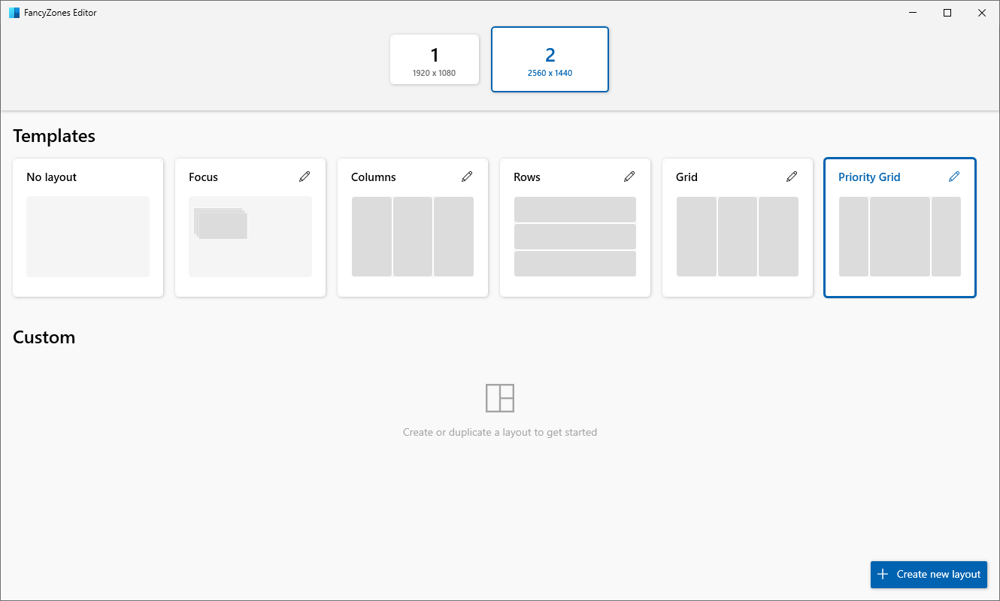{loading="lazy"}

The editor allows great freedom of choice.

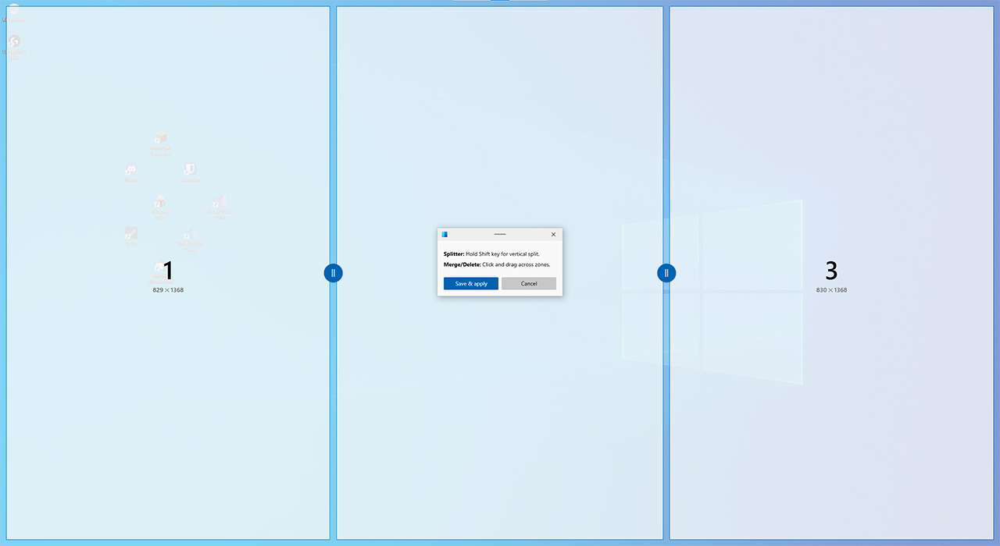{loading="lazy"}

### File Explorer add-ons

After enabling the 'preview pane' in Windows explorer 'view' settings you can directly preview markdown or svg files.

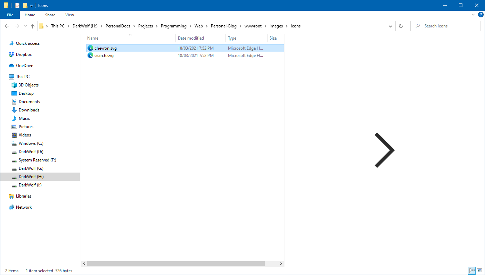{loading="lazy"}

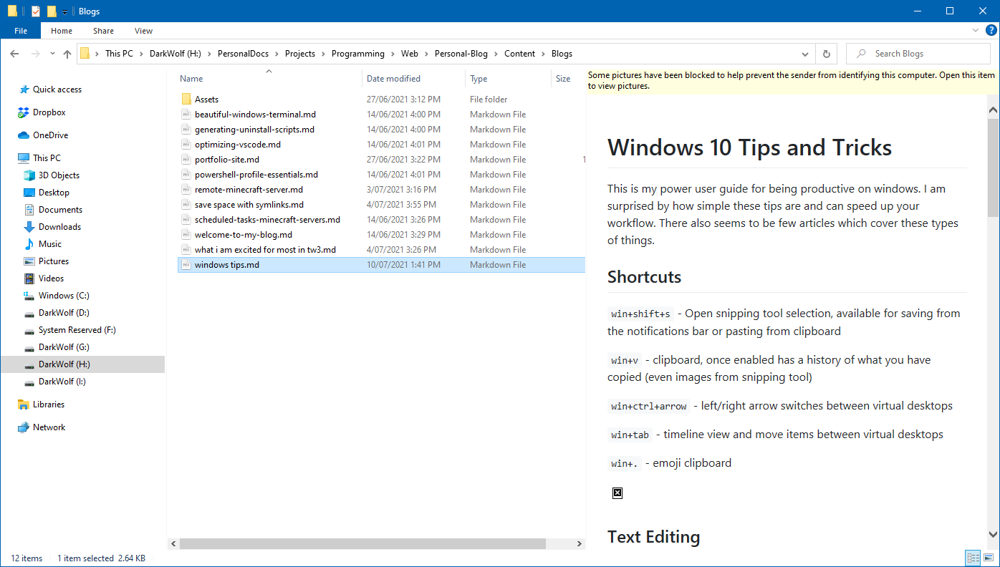{loading="lazy"}

### PowerToys Run

PowerToys run allows you to search for files, processes, applications and more. You can either text search or use [Action Keys](https://docs.microsoft.com/en-us/windows/powertoys/run#action-keys){target="__blank"}

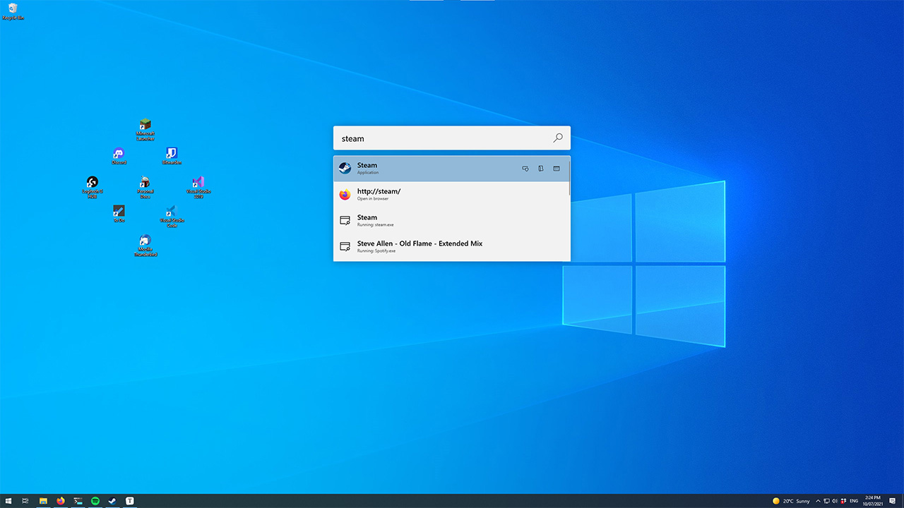{loading="lazy"}

## Windows Games Bar

`win+g` will open up the 'Windows Games Bar', an overlay which contains various widgets including volume mixer, performance, spotify integration, screen capture and more. You can monitor or edit these widgets whilst in a game or full screen application and pin items to persist the overlay.

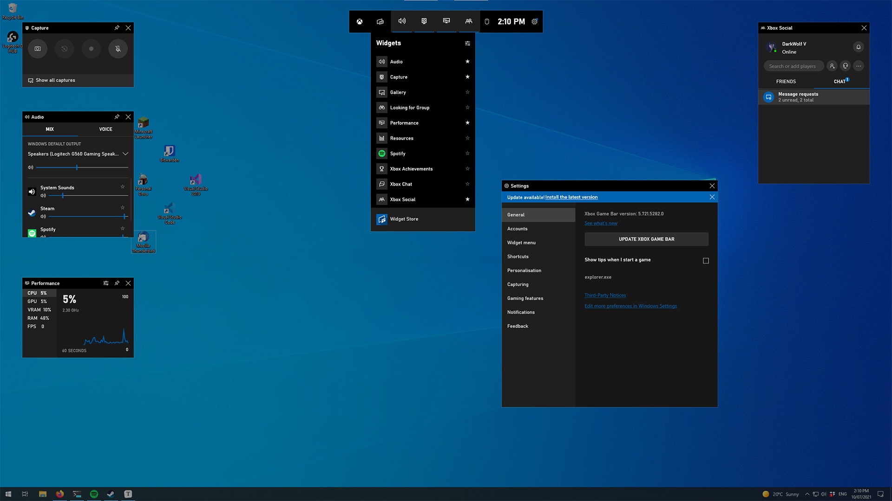{loading="lazy"}

## Edge Applications

The new Microsoft Edge which is based on chromium is quite a good browser and has fantastic integration with windows. You can visit any website and install it as an application from the side menu. While it will still technically be running in edge, it will then be available from your start menu and can be pinned and appear as its own application. This is particularly useful for apps such as Spotify, Jira, Trello or Pinterest and in some ways is better than their respective desktop applications.

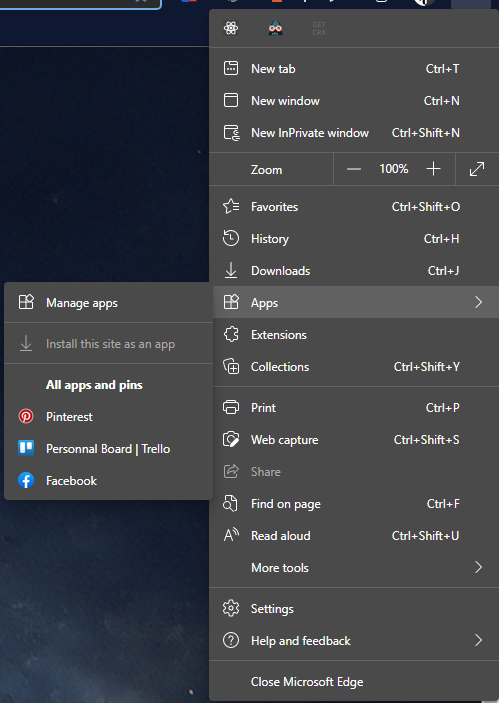{loading="lazy"}

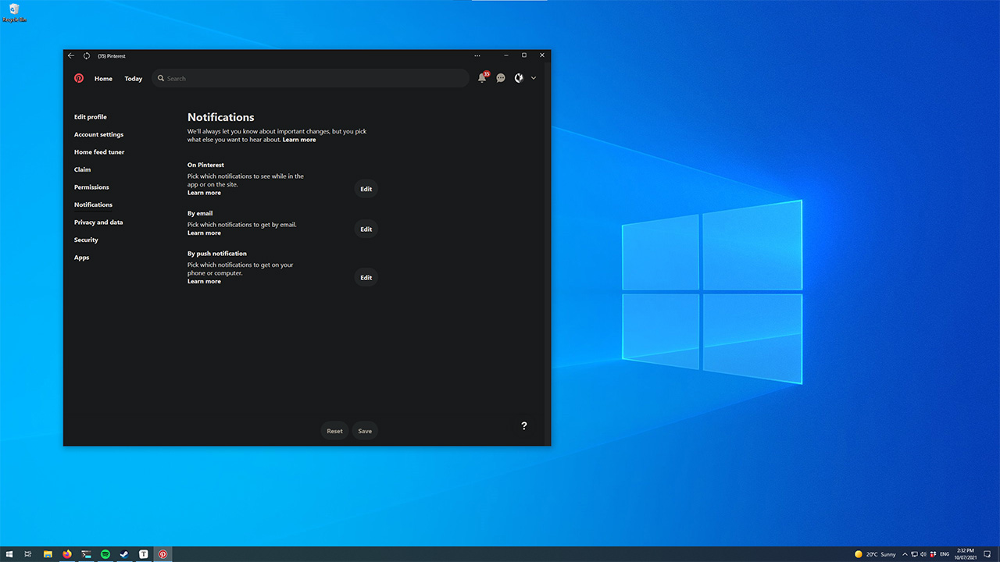{loading="lazy"}

### Windows Terminal Quake Mode

From Windows terminal 1.9+ you can use Quake Mode in windows terminal with 'win+`'. This provides an excellent experience where you can browse or perform other operations and have a terminal instantly available. This only adds to the amazing windows terminal experience. You can set your terminal to look like mine, using my [Beautiful Windows Terminal](./beautiful-windows-terminal){target="__blank"} guide.

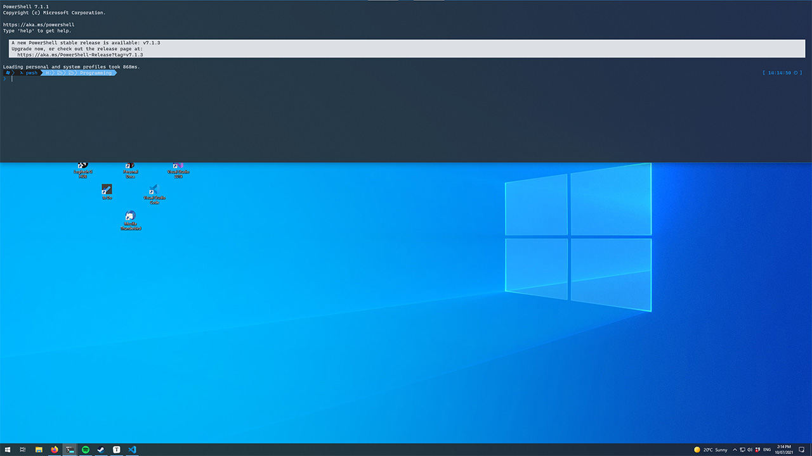{loading="lazy"}

I hope you have found this tips & tricks guide useful. I am always on the lookout for more tools I can use to optimise my desktop experience and improve productivity.
